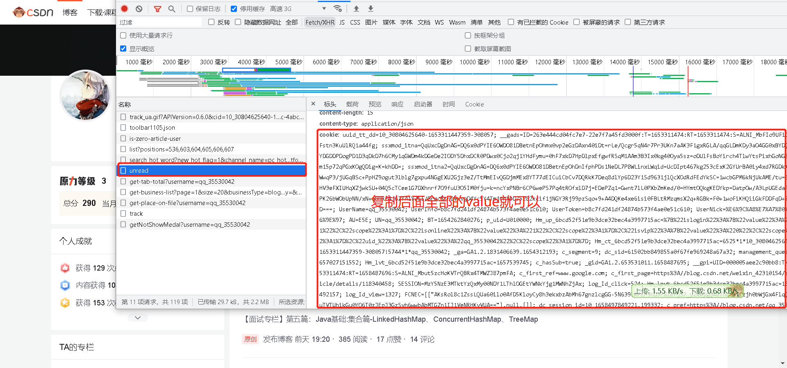
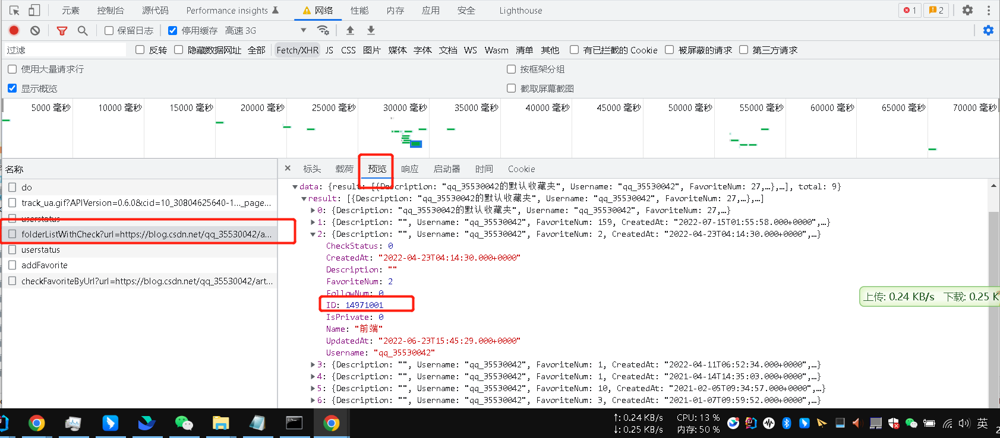

# 粉丝关注自动三连返回
有粉丝关注我们或者给我们点赞，我们应该及时回复别人，维护好关系，但是每时每刻盯着电脑太浪费时间了，所以有了自动回三连

> 大家自用互助，千万别干坏事，仅作为学习交流~

逻辑就是：
1. 定时多久扫描我的消息栏（前提登录），看是否有点赞、收藏、关注、评论的信息
2. 有的话，则顺着用户id去查看用户的第一篇文章，给他返回一个关注、点赞、评论，记录一下到本地
3. 如果已经返过了，那就不用返了（这个需要存储，暂时用本地文件做了个UniqDatasource）
4. 记录的逻辑是：关注：关注人-被关注人唯一；点赞人-文章id唯一、收藏人-文章id唯一；
5. 如果是自己的排除

开发过程中发现：
1. 评论有限流
2. 点赞文章有上限
3. 评论相似过多或者举报会被禁言两天，很不方便
4. 如果别人回复你的评论也会收到消息，需要特殊处理；点赞评论、社区留言等都会收到
5. 无法区分是否是三连还是正常用户的，容易造成骚扰
6. 目前是被动接受，无法主动发起
7. 三连有些用户是指定要求回哪篇三连的，而不是最新的一篇

## 使用说明
> 
> 运行前提是Java环境哈，考虑大家不一定是Java开发所以这里贴个粉丝发的教程 `一一哥`
> 
> [jdk mac环境安装](http://t.csdn.cn/bhzhs)
> 
> [jdk window环境安装](http://t.csdn.cn/yT8RU)
> 
> [idea 配置详解](http://t.csdn.cn/5b6AL)
> 
> 然后按下面的修改做即可
> 

1. 获取你的cookie(登录你的个人页，打开浏览器调试F12，随便找一个请求点开，复制如图的value) 粘贴到 top.chen.fansback.common.cmd.CsdnRequest.CSDN_COOKIE 字符串

2. 配置收藏夹id，收藏文章都会到这个文件夹（top.chen.fansback.common.cmd.CsdnRequest.defaultFavFoldId）
这个在电脑上点收藏的时候，打开浏览器的调试（F12），选到网络-选择fetch/xhr , 然后点一下收藏（会出来收藏列表）,选择你想把三连保存到哪个收藏夹下的id复制到这

3. top.chen.fansback.common.spider.csdn.BackFansSpider.run 程序入口（每分钟运行一次,只扫描最近一页消息，如果消息多可以把执行频率加大）

## 配置项&说明
1. 评论的文案：top.chen.fansback.common.BackProperties 这里面(欢迎大家提交新的文案供大家参考)
2. 点赞每天有限制
3. 评论每分钟限流3条，所以sleep 了 21秒
4. 有时候自己给自己三连也会触发回的逻辑，可以到 top.chen.fansback.common.cmd.CsdnRequest.OWNER 配置自己的name（打开自己的主页，比如我的：https://blog.csdn.net/qq_35530042）qq_35530042就是我的name

# 想直接运行在服务器上可以配置好后参考[托管到云服务器一直运行](cloud.md)

# 后续考虑&欢迎PR

> 其他语言版本的可以拉新分支或者自己建仓库都行
> 
> 在一个git上面集中一点，想自己搞也没啥问题，反正欢迎学习交流
> 

- 博客浏览量
- 针对接龙主动三连
- 其他平台三连
- 平台化
- 定时任务可视化
- springboot 接入
- 回复数据可追踪
- 

# Q&A

有问题可以直接提git issue 我会及时回复
如果很迫切或者想和其他同学交流或者讨论想法可以加我微信【进群】拉进群

